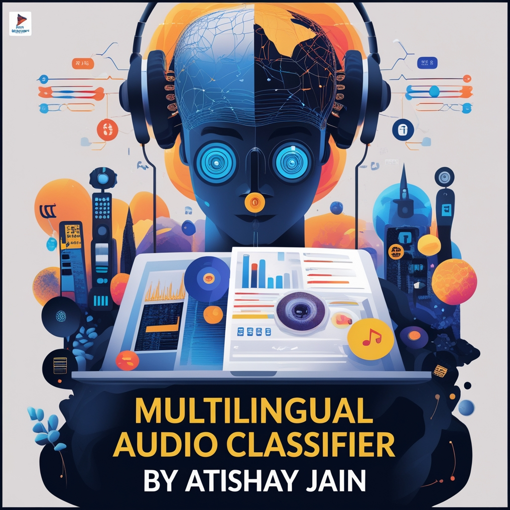

# Multilingual Audio Classifier

◦Engineered a multilingual audio classification system using CNN with TensorFlow and Keras, achieving 98% accuracy and 92% validation accuracy through advanced spectrogram preprocessing.
 
◦Leveraged transfer learning with ResNet50 to enhance model performance, optimizing the neural network architecture and improving classification accuracy across diverse audio data sets.

